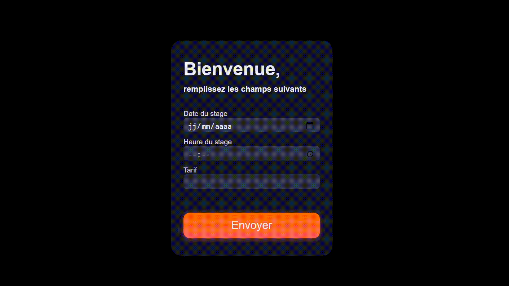

# Stage-Golf-Formulaire

<b> ⚠️ Ce projet a été dévelloppé dans un cadre pédagogique lors du notre 3ème semestre à l'IUT Informatique de Dijon-Auxerre.
Il sagit d'un TP réalisé en 12 heures. </b>

 
<h2> 🖱️ Les technologies utilisées </h2>
   
<b> ➡️ Langages: </b> MySql, PHP, HTML, CSS  
<b> ➡️ Temps de travail: </b> 12 heures  
<b> ➡️ Environnement: </b> PHPStorm, Visual Studio Code, Linux, SQL Workbench, PhpMyAdmin  
<b> ➡️ Point clé: </b> Le formulaire a été généré grâce à une bibilotèque de classe PHP que j'avais créé pour faciliter et modulariser mon travail
 
  

# Le formulaire en action

      
 

# Les fonctionnalités principales

<h2> Création de stage </h2>
Il sagit d'un formulaire pour qu'un moniteur créé un stage (en base de donnée)
Le code n'est pas optimisé, il sagit d'un proof of concept dasn le cadre d'un TP pour s'entrainer sur l'interaction formulaire et base de donnée
• Gestion d'exception lié à la connexion et à l'insertion dans une base de donnée
